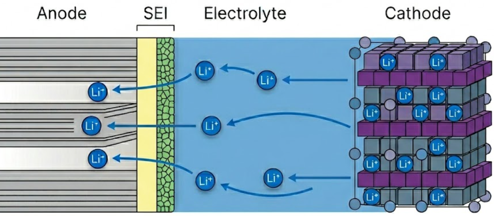
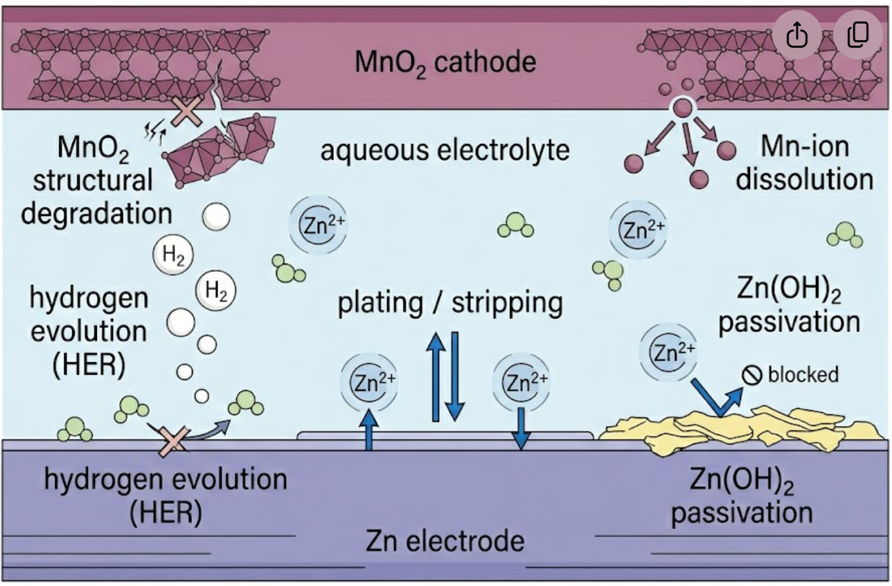
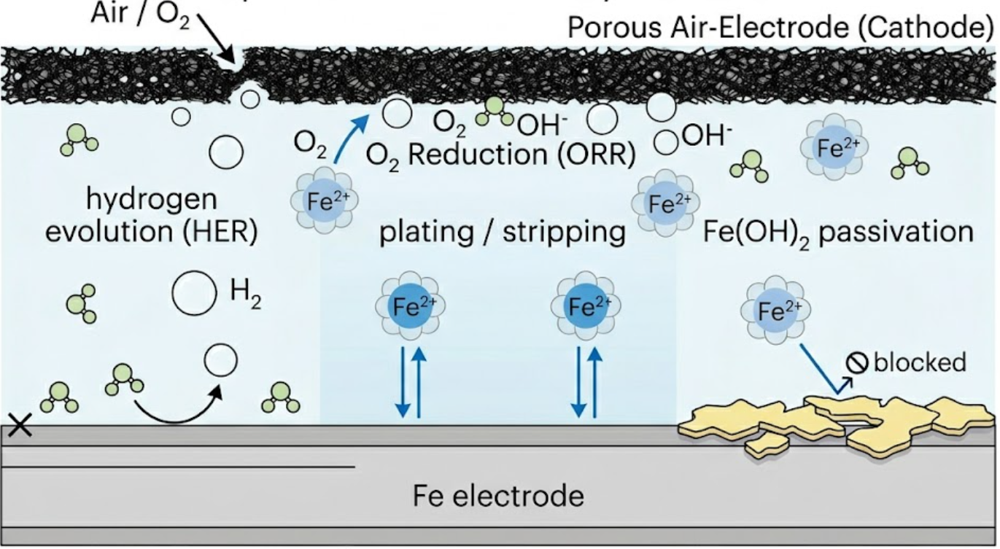

# Our research

  

    
  

  
Electrode–electrolyte interphases are nanometer-thin layers that form at the boundary between battery electrodes and the liquid electrolyte. Despite their small size, they govern ion transport, chemical stability, and ultimately the lifetime and safety of rechargeable batteries. Our group engineers these interphases across several battery chemistries and develops the tools to study and optimize them. These chemistries span lithium-ion, aqueous zinc, and emerging iron systems, united by a focus on the metal plating and stripping reactions that decide capacity and reversibility. We tune electrolyte composition to steer how interphases nucleate and conduct ions, and we watch them form operando — combining real-time gas analysis, nanogram-scale mass measurements, and self-driving laboratories that pair automated experiments with machine learning to navigate vast compositional spaces.

A layer only nanometers thick decides whether a battery lasts a thousand cycles or fails in ten.

## Electrochemical energy storage

  <figure class="intro-figure" style="float: left; width: 300px; margin: 0.4em 1.75em 0.5em 0;">
    
    <figcaption class="feature-caption">Li⁺ shuttles across the SEI between anode and cathode; the interphase's chemistry sets how efficiently it moves.</figcaption>
  </figure>
  <h3>Lithium-ion batteries</h3>
  
The dominant technology for portable electronics and electric vehicles. We investigate how electrolyte composition shapes the solid electrolyte interphase (SEI), with the goal of extending cycle life and enabling higher-energy electrode materials. Formed as the electrolyte reduces at the anode, the SEI must conduct Li⁺ while blocking further decomposition, and its stability largely sets how a cell ages: a uniform, mechanically robust interphase preserves capacity over thousands of cycles, whereas an unstable one drives continuous lithium loss and fade. The SEI also governs fast charging — its ionic conductivity and resistance to lithium plating determine how quickly the anode can be charged without metallic lithium depositing on its surface and compromising safety.

  <figure class="intro-figure" style="float: right; width: 300px; margin: 0.4em 0 0.5em 1.75em;">
    
    <figcaption class="feature-caption">In aqueous zinc electrolytes, reversible plating competes with hydrogen evolution and hydroxide precipitation.</figcaption>
  </figure>
  <h3>Zinc-ion batteries</h3>
  
A low-cost, water-based alternative with inherent safety advantages. We study interphase formation in aqueous zinc electrolytes, where managing side reactions such as hydrogen evolution and zinc hydroxide precipitation is critical to achieving reversible cycling. Built around an abundant zinc-metal anode and a non-flammable aqueous electrolyte, these cells are well suited to stationary and grid-scale storage, where cost and safety outweigh energy density. The same water that makes them safe can also be reduced at the anode to evolve hydrogen, raising the local pH and precipitating passivating zinc hydroxide. By tailoring electrolyte composition we suppress these side reactions and steer zinc plating toward high, reversible Coulombic efficiency. On the cathode side, manganese dioxide (MnO₂) is among the most studied hosts, but it brings its own difficulties. During discharge, reduction of Mn⁴⁺ generates Jahn–Teller-active Mn³⁺ that disproportionates and dissolves manganese into the electrolyte, gradually eroding the active material and fading capacity. Repeated (de)insertion of Zn²⁺ — often accompanied by competing H⁺ insertion and the growth of zinc-hydroxide byproducts — drives structural rearrangement and an intricate, still-debated charge-storage mechanism. Combined with the sluggish solid-state diffusion of divalent Zn²⁺, these effects limit rate capability and long-term cycling stability.

  <figure class="intro-figure" style="float: left; width: 300px; margin: 0.4em 1.75em 0.5em 0;">
    
    <figcaption class="feature-caption">The Fe²⁺/Fe³⁺ redox couple cycles charge — an earth-abundant route to grid-scale storage.</figcaption>
  </figure>
  <h3>Iron-ion batteries</h3>
  
An emerging, earth-abundant chemistry with potential for grid-scale storage. We explore the electrochemistry of iron redox couples and the interphases that must be stabilized to make these systems practically viable. Built on cheap, non-toxic iron and aqueous Fe²⁺ electrolytes, these cells are attractive for stationary storage, but the iron anode is difficult to cycle reversibly. Because the Fe²⁺/Fe plating potential sits close to that of water reduction, hydrogen evolution competes directly with iron deposition, lowering Coulombic efficiency and driving self-discharge, while iron hydroxide and oxide films passivate the surface and uneven deposition roughens the electrode over repeated cycles. We address these losses through electrolyte formulation and interphase engineering — pH-buffering and additives that suppress hydrogen evolution and promote uniform plating, together with protective surface layers that conduct Fe²⁺ while blocking parasitic side reactions. On the cathode side, the divalent Fe²⁺ ion diffuses sluggishly through most hosts, so we study open-framework materials such as vanadium oxides and phosphates that accommodate reversible Fe²⁺ (de)insertion and work to stabilize the iron redox against dissolution and structural fatigue. Together, these strategies aim to convert iron's abundance and safety into durable, long-cycling storage.

Across all three chemistries, we work on **metal plating and stripping electrodes** — the processes by which metal ions deposit onto and dissolve from an electrode surface. Controlling nucleation, morphology, and Coulombic efficiency during these processes is essential for high-capacity, dendrite-free energy storage.

## Methodology

**Electrolyte exploration and exploitation** is central to our work. We design and formulate electrolytes to tune interphase chemistry and improve electrochemical stability — the starting point that feeds every measurement and model below.

  <figure class="feature-media">
    
    <figcaption class="feature-caption">Gas released during cycling is carried straight into a mass spectrometer, fingerprinting decomposition products in real time.</figcaption>
  </figure>
  

    <h3>Online Electrochemical Mass Spectrometry (OEMS)</h3>
    
Lets us track gas evolution in real time during battery operation, directly identifying decomposition pathways and linking electrolyte chemistry to interphase formation mechanisms.

  

  <figure class="feature-media">
    
    <figcaption class="feature-caption">A resonating quartz crystal weighs the growing film while its damping reveals whether the layer is rigid or soft.</figcaption>
  </figure>
  

    <h3>Electrochemical Quartz Crystal Microbalance with Dissipation (EQCM-D)</h3>
    
Provides simultaneous measurements of mass and viscoelastic changes at electrode surfaces, giving us a nanoscale view of how interphases grow, dissolve, and respond to cycling.

  

  <figure class="feature-media">
    
    <figcaption class="feature-caption">Formulation, measurement, and machine-learning prediction run as a closed loop that proposes the next experiment.</figcaption>
  </figure>
  

    <h3>Self-driving laboratories</h3>
    
Integrate automated electrochemical testing with machine learning to accelerate electrolyte discovery. By closing the loop between formulation, measurement, and prediction, we navigate large compositional spaces far more efficiently than traditional one-at-a-time experimentation.

  

