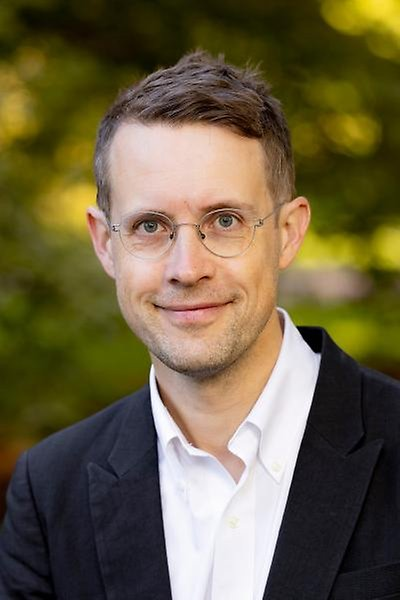

# Our Team

## Principal Investigator

  

    
    <h3>Erik Berg</h3>
    
Principal Investigator

    
Electrode–electrolyte interphases, electrolyte formulation, self-driving laboratories

  

## Postdoctoral Fellows

  

    
    <h3>Name</h3>
    
Research topic

  

## PhD Students

  

    
    <h3>Name</h3>
    
Research topic

  

## BSc / MSc Students

  

    
    <h3>Name</h3>
    
Research topic

  

